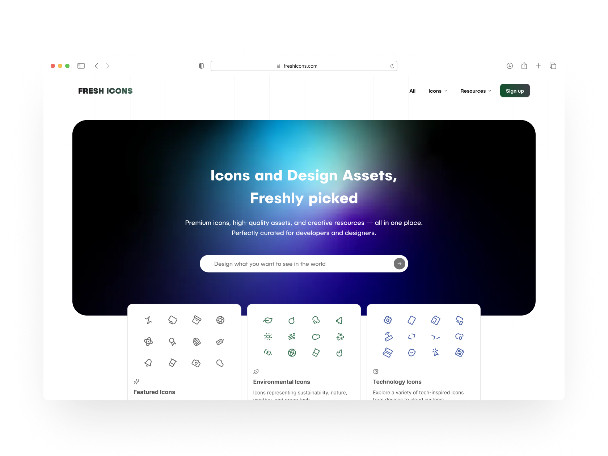

# FreshIcons

**FreshIcons** — a modern eCommerce platform for designers and developers to discover, preview, and purchase premium icon packs and creative resources.

## Overview

FreshIcons was born out of a desire to create a space for *high-quality, hard-to-find icons and assets* that go beyond what standard libraries like Lucide or Feather provide.  

I wanted an elegant, modern shopping experience tailored to creatives — smooth motion, clean interactions, and an interface that feels enjoyable to use.  

This project brings together authentication, payments, storage, and animation into one cohesive full-stack product.

---

## Features

- 🛒 **ECommerce Storefront** — browse and purchase premium icons  
- 💳 **Stripe Checkout Integration** — secure payments for individual and bundle packs  
- 👤 **Auth with Clerk** — user accounts, order history, and downloads  
- ⚙️ **Real-time Backend via Convex** — handles user data and dynamic content  
- 💾 **Supabase Storage** — serves icons and assets efficiently  
- ✨ **Framer Motion Animations** — smooth UI transitions and hover interactions  
- 🌐 **Deployed on Netlify** — fast, serverless performance  

---

## Tech Stack

- Framework: **Next.js (App Router)**  
- Language: **TypeScript**  
- Styling: **TailwindCSS**  
- Payments: **Stripe**  
- Authentication: **Clerk**  
- Backend Logic: **Convex**  
- Storage: **Supabase**  
- Animation: **Framer Motion**  
- API Gateway: **Zuplo**  
- Hosting: **Netlify**

---

## Demo

- [Live Website](https://freshicons.co/)  
- [Figma Design](https://www.figma.com/design/MgHBK93S8sjHlEohegWvHZ/%E2%AD%90%EF%B8%8F-FreshIcons---Kelsie-Murphy-s-Portfolio)

---

## Getting Started (Local Development)

### Prerequisites

- Node.js (LTS recommended)  
- npm, pnpm, or yarn  
- Stripe and Clerk accounts  
- Convex and Supabase projects for backend and storage  

---

### 1. Clone the repository

    git clone https://github.com/kelsiesmurphy/freshicons-frontend.git  
    cd freshicons-frontend

---

### 2. Install dependencies

    npm install  
    # or  
    yarn  
    # or  
    pnpm install

---

### 3. Configure environment variables

Create a `.env.local` file in the project root and include:

    # Clerk
    NEXT_PUBLIC_CLERK_PUBLISHABLE_KEY=pk_XXXX
    CLERK_SECRET_KEY=sk_XXXX

    # Stripe
    STRIPE_SECRET_KEY=sk_test_XXXX
    NEXT_PUBLIC_STRIPE_PUBLISHABLE_KEY=pk_test_XXXX
    STRIPE_WEBHOOK_SECRET=whsec_XXXX

    # Convex
    CONVEX_DEPLOYMENT=dev:XXXX
    NEXT_PUBLIC_CONVEX_URL=https://your-convex-instance.convex.cloud

    # Supabase
    NEXT_PUBLIC_SUPABASE_URL=https://XXXX.supabase.co
    NEXT_PUBLIC_SUPABASE_ANON_KEY=XXXX

    # App Config
    NEXT_PUBLIC_SITE_URL=http://localhost:3000

---

### 4. Run the development server

    npm run dev  
    # or  
    yarn dev  
    # or  
    pnpm dev

Then open http://localhost:3000 in your browser.

---

## Scripts

- dev — Start local development server  
- build — Build for production  
- start — Run production server  
- lint — Run linting  
- test — Run tests  

Example usage:

    pnpm run build  
    pnpm run dev

---

## Data & Security Considerations

- All keys (Clerk, Stripe, Convex, Supabase) should be kept private and never committed.  
- Stripe webhook handling should be verified via test mode before production.  
- Ensure Clerk origins and Stripe webhook URLs are properly configured.  

---

## Troubleshooting

- **Stripe payments failing:** Verify API keys and webhook secret.  
- **Auth errors:** Check Clerk origin settings and valid publishable keys.  
- **Asset loading issues:** Confirm Supabase public bucket permissions and file paths.  

---

## Author & Contact

### Kelsie Murphy

- Portfolio: [https://kelsiesmurphy.com](https://kelsiesmurphy.com)  
- GitHub: [https://github.com/kelsiesmurphy](https://github.com/kelsiesmurphy)

---

**Thanks for checking out FreshIcons!**
